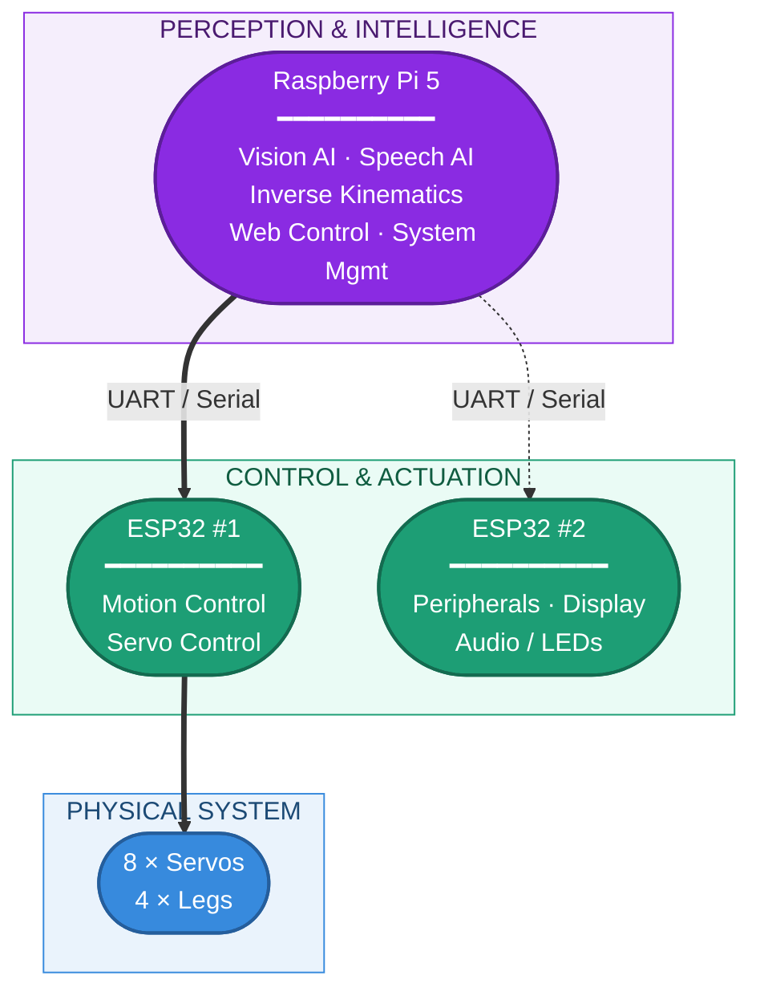
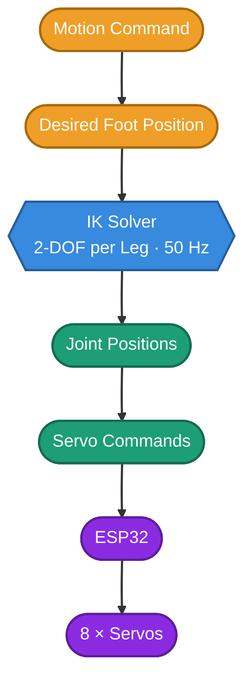
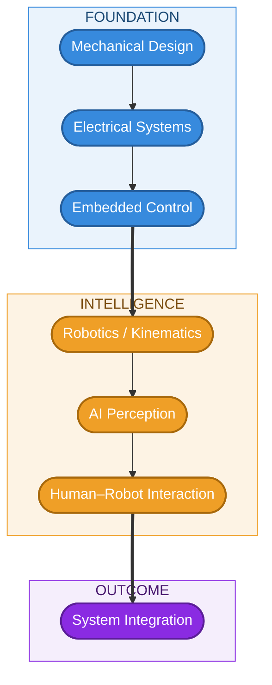

<div align="center">


# 🐾 NeuraBot
### AI-Enabled 8-DOF Quadruped Robotics Platform

**Mechanical Design · Embedded Systems · Robotics · Computer Vision · Speech AI · Power Management · Human–Robot Interaction**

[](https://www.raspberrypi.com)
[](https://www.espressif.com)
[](https://ultralytics.com)
[](https://openai.com/whisper)
[](/)
[](/)

<br>

[Overview](#overview) • [Architecture](#-engineering-architecture) • [AI](#-artificial-intelligence) • [Hardware](#-hardware-configuration) • [Build](#-build-process) • [Roadmap](#-development-status)

</div>

<br>

## Overview

**NeuraBot is a custom-built quadruped robotics platform** integrating mechanical design, embedded control, real-time inverse kinematics, artificial intelligence, human–robot interaction, browser-based control, and intelligent power monitoring into a single robotic system.

The platform is built around a **Raspberry Pi 5 + dual ESP32 architecture**, combining high-level computation and AI processing with distributed embedded control of the robot's physical systems.

Every major subsystem — from the **3D-printed mechanical structure and servo-driven locomotion** to the **AI perception, speech interface, web control, and power monitoring** — forms part of one integrated engineering platform.

> 💡 NeuraBot is developed as an engineering platform and technical design portfolio, with emphasis on system integration, robotics architecture, and practical implementation.

<br>

## 📋 System at a Glance

| Subsystem | Implementation |
|:---|:---|
| 🦾 **Locomotion** | 8-DOF quadruped · 2 actuated joints per leg |
| 🧠 **Main Computer** | Raspberry Pi 5 |
| ⚙️ **Embedded Control** | Dual ESP32 controllers |
| 📐 **Robotics** | Real-time geometric inverse kinematics |
| 👁️ **Computer Vision** | YOLOv5 real-time object detection |
| 🎙️ **Speech Interface** | Whisper STT + Google TTS |
| 🌐 **Robot Interface** | Browser-based control and telemetry |
| ⚡ **Power System** | Dual INA219 rail monitoring + low-voltage cutoff |
| 📺 **Human–Robot Interface** | LCD display, microphone, speaker, and LEDs |
| 🔋 **Battery** | 2S 7000mAh LiPo |

<br>

## 🏗️ Engineering Architecture


NeuraBot uses a distributed architecture that separates **high-level computation and AI processing** from **real-time embedded hardware control**.



This architecture provides a clear separation of responsibilities:

| Layer | Component |
|:---|:---|
| **Perception & Intelligence** | Raspberry Pi |
| **Control & Actuation** | ESP32 |
| **Physical System** | Servos + mechanical structure |

<br>

## 🦿 Locomotion & Robotics

### 8-DOF Quadruped

NeuraBot uses **two actuated joints per leg across four legs**, resulting in an 8-DOF locomotion system. The architecture is intentionally compact, providing a practical balance between:

- Mechanical complexity
- Actuator count
- Control complexity
- Computational requirements
- Physical size

**Documented locomotion behaviors:** Stand · Walk · Trot · Sit · Shake

### Real-Time Inverse Kinematics

The locomotion system uses a **geometric 2-DOF inverse kinematics solver for each leg**, operating at **50 Hz**.



This forms the core robotics layer responsible for converting high-level movement requirements into leg joint positions.

<br>

## 🤖 Artificial Intelligence

### 👁️ Computer Vision

NeuraBot integrates **YOLOv5** for real-time object detection.

- Real-time object detection
- ~15 FPS operation
- Annotated camera output
- Integration with the browser-based robot interface

Camera hardware: **5MP Raspberry Pi infrared night-vision camera (OV5647 sensor)**.

### 🎙️ Speech Interaction

| Function | Technology |
|:---|:---|
| Speech-to-text | Whisper |
| Text-to-speech | Google TTS |

The system includes voice-command routing and the wake word **"NeuraBot"**, providing a human–robot interaction layer above the robot's physical control system.

<br>

## 🌐 Webpage Control

NeuraBot includes a browser-based control interface, streamlined to a single focused **Control** view.

<div align="center">

**[🕹️ Open the Live Interactive Demo →](https://claude.ai/artifact/HR4XYciM7qzo5DZoajj6ZH)**

*Drag the joystick, pick a gait, and adjust the master controller to see live servo angle readouts — fully interactive, right in your browser.*

</div>

**Control**
- Directional control via draggable joystick
- Gait selection — Stand, Walk, Trot, Sit, Shake
- Master controller (speed)
- Per-servo angle readout (8 channels)

The browser interface allows the robot to be operated without requiring direct physical interaction with the embedded controllers.

> ℹ️ GitHub's README renderer sanitizes embedded scripts and stylesheets, so the interface can't run inline on this page — the link above opens the fully functional version.

<br>

## ⚡ Power Management

Power management is treated as a dedicated subsystem within the robot architecture.

- **2S 7000mAh LiPo battery**
- **Dual INA219 monitoring**
- Rail-level electrical monitoring
- **Low-voltage cutoff**

The power architecture provides monitoring and protection functionality while separating the robot's power and control requirements.

📄 Detailed electrical documentation: **[Power Architecture](docs/Architecture/README.md)**

<br>

## 🎛️ Peripheral & Interaction Layer

NeuraBot incorporates several peripherals to provide system feedback and human interaction.

| Device | Function |
|:---|:---|
| 0.96" 128×64 I2C LCD | Face / system status |
| USB Microphone | Audio input |
| MAX98357 amplifier | Audio output |
| WS2812B LEDs | Visual indication |
| OV5647 Camera | Vision and live streaming |

These peripherals extend the platform beyond locomotion and provide the foundation for a more interactive robotic system.

<br>

## 🔧 Mechanical Engineering

NeuraBot's physical platform is custom designed and fabricated using **3D-printed components**, covering:

Main body · Quadruped legs · Head assembly · Servo mounts · Electronics mounts · Battery compartment · Camera mounting · Cable routing · Electrical harness

The design process progresses from individual printed components to a fully integrated robotic platform.

**3D Model:** [View / Download NeuraBot Full-Body Model](docs/Miscellaneous/NeuraBotProject-FullBody.stl)

<br>

## 🛠️ Build Process

| Stage | Engineering Activity |
|:---:|:---|
| 01 | 3D-printed body, legs, head, and mounts |
| 02 | Body frame and leg assembly |
| 03 | Installation of 8 servo actuators |
| 04 | Raspberry Pi and dual ESP32 integration |
| 05 | Power distribution and LiPo bay wiring |
| 06 | Head assembly — display, camera, and microphone |
| 07 | Cable routing and electrical harness |
| 08 | Initial IK and gait testing |
| 09 | Fully integrated NeuraBot |

📄 For detailed assembly instructions, see the **[Build Guide](docs/Guide/README.md)**.

<br>

## 📸 Gallery

<div align="center">

<br><em>Full Unit</em>
</div>

<br>

## 🔩 Hardware Configuration

| Component | Specification | Qty |
|:---|:---|---:|
| Single-Board Computer | Raspberry Pi 5 | 1 |
| Microcontroller | ESP32 DevKit v1 | 2 |
| Servo Actuators | MG996R / DS3218MG — 20 kg·cm | 8 |
| Battery | 2S LiPo — 7000mAh — 30C+ | 1 |
| Camera | 5MP Raspberry Pi Infrared Night Vision — OV5647 | 1 |
| Microphone | Generic USB Microphone | 1 |
| Display | 0.96" 128×64 I2C LCD | 1 |
| Power Monitoring | INA219 I2C | 2 |
| Structural Material | PLA+ | — |

<br>

## 📁 Repository Structure

```text
NeuraBot/
│
├── docs/
│   ├── Guide/
│   │   └── README.md
│   │
│   ├── Architecture/
│   │   └── README.md
│   │
│   └── Miscellaneous/
│       ├── Neurabot image 1.png
│       ├── Neurabot image 5.png
│       ├── Block Diagram-5.png
│       └── NeuraBotProject-FullBody.stl
│
└── README.md
```

The repository currently focuses on **engineering documentation, system architecture, mechanical development, assembly, and design evidence**.

<br>

## 📚 Technical Documentation

| Documentation | Purpose |
|:---|:---|
| [Build Guide](docs/Guide/README.md) | Step-by-step mechanical and system assembly |
| [Power Architecture](docs/Architecture/README.md) | Electrical power architecture and documentation |
| [3D Model](docs/Miscellaneous/NeuraBotProject-FullBody.stl) | Full-body 3D model |

<br>

## 📊 Development Status

| Version | Development Stage | Status |
|:---|:---|:---:|
| `v0.1` | Mechanical design & 3D printing | ✅ |
| `v0.2` | Basic ESP32 servo control | ✅ |
| `v0.3` | Inverse Kinematics engine | ✅ |
| `v0.4` | Web control interface | ✅ |
| `v0.5` | Vision AI — YOLOv5 | ✅ |
| `v0.6` | Speech AI — Whisper + Google TTS | ✅ |
| `v0.7` | Power management system | ✅ |
| `v0.8` | Autonomous navigation | ⬜ |
| `v0.9` | SLAM mapping | ⬜ |
| `v1.0` | Emotion expression system | ⬜ |
| `v1.1` | ROS2 integration | ⬜ |

<br>

## 🗺️ Engineering Roadmap

Future development is focused on increasing the autonomy and robotics capabilities of the platform.

| Direction | Description |
|:---|:---|
| **Navigation** | Autonomous movement and navigation capabilities |
| **Mapping** | SLAM-based environmental mapping |
| **Interaction** | Expanded expressive and human–robot interaction capabilities |
| **Robotics Middleware** | Future integration with **ROS2** to support a broader robotics software ecosystem |

<br>

## 🎯 Engineering Focus

NeuraBot brings together multiple engineering disciplines into one integrated platform:



The project demonstrates the development of a robotic system from **physical design and fabrication through embedded control, robotics algorithms, AI integration, and operator interaction**.

<br>

## 💭 Project Philosophy

> **Integrate the physical, computational, and intelligent layers of a robot into one coherent system.**

The project treats the robot not as a collection of independent components, but as a complete engineering system in which:

| Layer | Role |
|:---|:---|
| **Mechanical Design** | Provides the physical platform |
| **Embedded Control** | Drives the actuators |
| **Robotics Algorithms** | Generate movement |
| **AI** | Provides perception and interaction |
| **Power Management** | Monitors the electrical system |
| **Web Interface** | Connects the operator to the robot |

<br>

## 🟠 Status: In Development

NeuraBot remains an evolving robotics platform. The current repository documents the project's **mechanical design, hardware architecture, system integration, control capabilities, AI subsystems, and development roadmap**.

Future development will expand the platform toward greater autonomy, environmental mapping, expressive interaction, and robotics middleware integration.

<br>

<div align="center">

### 🐾 NeuraBot
**Custom Robotics Engineering Platform**

*Mechanical Design · Embedded Systems · Robotics · AI · Systems Integration*

**Built from Scratch · Technical Documentation · 2025**

</div>
